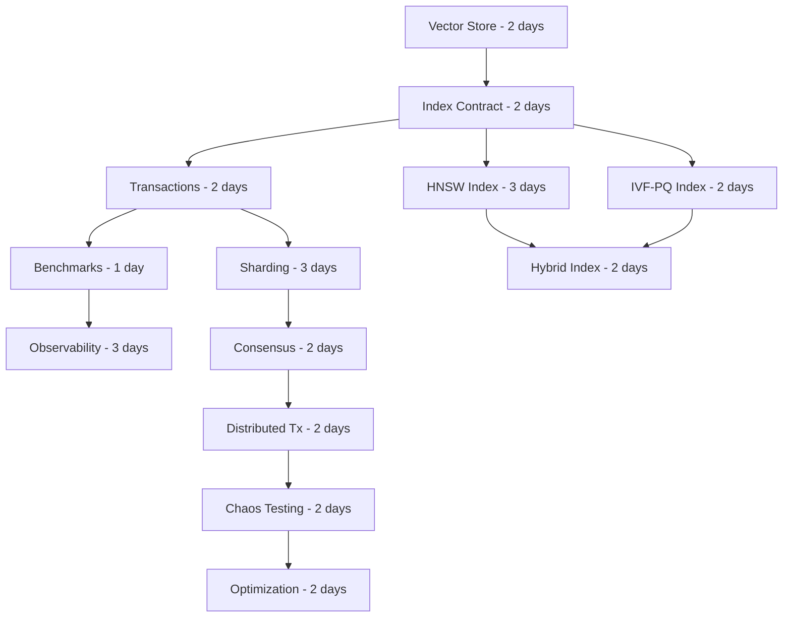

# Vector Database REST API - Architecture-First Perfect Implementation

## Critical Hidden Dependencies & Architectural Decisions

### The Real Challenge: Hidden Complexity

The original requirements hide massive complexity that will make or break this project:

## 1. CRITICAL HIDDEN DEPENDENCIES

### A. Embedding Dimension Consistency Problem
**Hidden Dependency**: Once you store the first vector in a library, you're locked into that dimension forever.

**Why This Matters**:
- Cohere's models produce different dimensions (384, 768, 1024, 1536)
- Mixing dimensions breaks every index algorithm
- You can't just "validate" this - you need architectural enforcement

**Required Architecture**:
```python
class LibraryEmbeddingContract:
    """Immutable contract established on first chunk insertion"""
    dimension: int
    model_name: str
    normalization: bool  # Critical: cosine similarity assumes normalized vectors

    def validate_vector(self, vector: np.ndarray) -> np.ndarray:
        """Validates AND transforms vector to match contract"""
        if vector.shape[0] != self.dimension:
            raise EmbeddingContractViolation
        if self.normalization:
            return vector / np.linalg.norm(vector)
        return vector
```

### B. Index Rebuild Cascade Problem
**Hidden Dependency**: Every index algorithm has different build requirements that cascade through the system.

**The Trap**:
- K-D Tree MUST be rebuilt completely when adding/removing vectors (no efficient incremental update)
- LSH can add incrementally but needs rebuild periodically for optimal performance
- HNSW graph needs complex rebalancing that affects connected nodes

**Required Architecture**:
```python
class IndexLifecycleManager:
    """Manages index state transitions and rebuild triggers"""

    def on_vector_add(self, vector_id: str, vector: np.ndarray):
        if self.index_type == IndexType.KD_TREE:
            self.mark_for_rebuild()  # Can't add incrementally
        elif self.index_type == IndexType.LSH:
            self.add_and_check_rebalance()
        elif self.index_type == IndexType.HNSW:
            self.add_with_graph_repair()

    def get_search_strategy(self) -> SearchStrategy:
        if self.needs_rebuild:
            return FallbackToBruteForce()  # Critical: Always have fallback
        return self.index.get_search_strategy()
```

### C. Memory Model & Vector Ownership Problem
**Hidden Dependency**: Who owns the vectors? The chunks? The index? Both?

**The Trap**:
- Naive: Store vectors in chunks AND in index = 2x memory
- Wrong: Store only in index = can't rebuild index without chunks
- Complex: Store in chunks, index holds references = pointer management nightmare

**Required Architecture**:
```python
class VectorStore:
    """Single source of truth for all vectors"""
    _vectors: np.ndarray  # Contiguous memory for cache efficiency
    _id_to_index: Dict[str, int]
    _index_to_id: Dict[int, str]
    _refcount: Dict[str, int]  # For safe deletion

    def get_vector_view(self, vector_id: str) -> np.ndarray:
        """Returns view, not copy - critical for performance"""
        idx = self._id_to_index[vector_id]
        return self._vectors[idx]  # NumPy view, O(1)
```

### D. Consistency Model for Concurrent Operations
**Hidden Dependency**: Thread safety isn't just about locks - it's about consistency guarantees.

**The Trap**:
- Add document with 100 chunks
- Crash after chunk 50
- Now what? Half-inserted document corrupts everything

**Required Architecture**:
```python
class TransactionalOperation:
    """All-or-nothing operations with rollback capability"""

    def execute(self):
        snapshot = self.create_snapshot()
        try:
            with self.acquire_write_lock():
                self.validate_preconditions()
                self.apply_changes()
                self.update_indexes()
                self.commit()
        except Exception as e:
            self.rollback_to(snapshot)
            raise
```

### E. Query Consistency During Index Rebuild
**Hidden Dependency**: What happens to queries while index is rebuilding?

**The Trap**:
- Block queries during rebuild = availability failure
- Use old index during rebuild = stale results
- No index during rebuild = fall back to O(n) brute force

**Required Architecture**:
```python
class DualIndexStrategy:
    """Maintain two indexes for zero-downtime rebuilds"""
    _active_index: VectorIndex
    _building_index: Optional[VectorIndex]
    _index_version: int

    async def rebuild_async(self):
        self._building_index = self.create_new_index()
        await self._building_index.build_async()  # Build in background

        # Atomic swap
        with self._swap_lock:
            old = self._active_index
            self._active_index = self._building_index
            self._building_index = None
            old.destroy()  # Clean up old index
```

### F. Persistence Format Evolution Problem
**Hidden Dependency**: Your persistence format WILL need to change, but you have data in production.

**The Trap**:
- Save everything as JSON = can't load 1GB file into memory
- Save as pickle = break on Python upgrade
- Save as custom binary = no forward compatibility

**Required Architecture**:
```python
class VersionedPersistence:
    """Forward-compatible persistence with migration support"""

    CURRENT_VERSION = 3

    def save(self, data: Any, path: Path):
        header = {
            'version': self.CURRENT_VERSION,
            'created_at': datetime.utcnow(),
            'index_type': data.index_type,
            'vector_dimension': data.dimension
        }
        # Save header separately for quick version check

    def load(self, path: Path) -> Any:
        header = self.read_header(path)
        if header['version'] < self.CURRENT_VERSION:
            return self.migrate(path, header['version'])
        return self.direct_load(path)

    def migrate(self, path: Path, from_version: int):
        """Chain migrations: v1->v2->v3"""
        for v in range(from_version, self.CURRENT_VERSION):
            path = self.migrations[v].migrate(path)
        return self.load(path)
```

## 2. ARCHITECTURAL DECISIONS THAT CANNOT BE CHANGED LATER

### Decision 1: Vector Storage Strategy
**MUST DECIDE NOW**: How vectors are stored affects everything.

**Option A: Document-Centric** (vectors in chunks)
- ✅ Simple mental model
- ❌ Horrible cache performance
- ❌ Can't vectorize operations

**Option B: Index-Centric** (vectors in index)
- ✅ Fast operations
- ❌ Tight coupling
- ❌ Hard to support multiple indexes

**Option C: Separated Vector Store** (recommended)
- ✅ Single source of truth
- ✅ Cache-friendly
- ✅ Multiple indexes can share
- ❌ More complex

**Implementation Impact**: This decision affects EVERY component.

### Decision 2: Consistency Model
**MUST DECIDE NOW**: What consistency guarantees do you provide?

**Option A: Eventually Consistent**
- Writes return immediately
- Queries might not see recent writes
- Requires: Async processing, message queue

**Option B: Strongly Consistent**
- Writes visible immediately
- Simple mental model
- Requires: Synchronous index updates, transaction log

**Option C: Tunable Consistency**
- Client chooses per operation
- Most flexible
- Requires: Multiple code paths, complex testing

### Decision 3: Index Selection Strategy
**MUST DECIDE NOW**: How does system choose which index to use?

**Option A: User-Specified**
- User picks on library creation
- Simple but user needs to understand indexes

**Option B: Auto-Selection**
- System picks based on data characteristics
- Requires: Heuristics, monitoring, auto-tuning

**Option C: Adaptive**
- System starts with brute force, upgrades as data grows
- Requires: Background analysis, migration logic

### Decision 4: Embedding Generation Responsibility
**MUST DECIDE NOW**: Who generates embeddings?

**Option A: Client Provides**
- API only accepts vectors
- Simple, but client needs embedding model

**Option B: Server Generates**
- API accepts text
- Requires: API key management, rate limiting, caching

**Option C: Hybrid**
- API accepts both
- Most flexible but two code paths

## 3. THE PERFECT IMPLEMENTATION PATH

### Foundation Phase (Week 1): Get Architecture Right
**Goal**: Unshakeable foundation that won't need changes

#### Day 1-2: Vector Storage Layer
```python
# This MUST be perfect from start - everything depends on it
class VectorStorageEngine:
    """
    Manages all vector storage with:
    - Memory-mapped files for out-of-core support
    - SIMD-aligned memory for vectorized operations
    - Copy-on-write for snapshots
    - Reference counting for safe deletion
    """
```
**Why First**: Every other component depends on how vectors are accessed

#### Day 3-4: Index Abstract Architecture
```python
# Define the contract that ALL indexes must fulfill
class IndexContract(Protocol):
    """Guarantees every index must provide"""

    @property
    def is_exact(self) -> bool: ...

    @property
    def supports_incremental(self) -> bool: ...

    @property
    def memory_usage(self) -> int: ...

    def estimate_search_time(self, k: int) -> float: ...
```
**Why Early**: Sets constraints for all index implementations

#### Day 5-6: Transactional Operation Framework
```python
class OperationContext:
    """Every operation is transactional"""

    def __enter__(self):
        self.snapshot = self.create_snapshot()
        self.acquire_locks()
        return self

    def __exit__(self, exc_type, exc_val, exc_tb):
        if exc_type:
            self.rollback()
        else:
            self.commit()
        self.release_locks()
```
**Why Critical**: Retrofitting transactions is nearly impossible

#### Day 7: Benchmark Framework
```python
class PerformanceBenchmark:
    """Measure EVERYTHING from day one"""

    def measure_operation(self, op: Operation) -> Metrics:
        return {
            'wall_time': ...,
            'cpu_time': ...,
            'memory_allocated': ...,
            'cache_misses': ...,  # Critical for vector operations
        }
```
**Why Now**: Can't optimize what you don't measure

### Algorithm Phase (Week 2): Implement Indexes Correctly

#### Day 8-10: Production HNSW Implementation
```python
class HNSW:
    """
    Hierarchical Navigable Small World

    This is what Pinecone/Weaviate actually use.
    Implementing this correctly shows real understanding.

    Critical details others miss:
    - Entry point optimization
    - Layer assignment probability
    - Pruning strategy for connections
    - Memory-efficient edge storage
    """
```
**Why HNSW**: This is the gold standard - implementing it well proves competence

#### Day 11-12: Optimized Product Quantization + IVF
```python
class IVFPQIndex:
    """
    Inverted File with Product Quantization

    Used by FAISS for billion-scale vectors.
    Shows understanding of:
    - Vector quantization theory
    - Inverted index structures
    - Asymmetric distance computation
    """
```
**Why**: Shows you understand how real vector databases scale

#### Day 13-14: Hybrid Index Strategy
```python
class HybridIndex:
    """
    Combines multiple strategies:
    - Exact search for high-value queries
    - Approximate for exploration
    - Cached results for repeated queries
    """
```

### Distributed Systems Phase (Week 3): Scale Beyond Single Node

#### Day 15-17: Sharding & Partitioning
```python
class ShardManager:
    """
    Partition vectors across nodes
    - Consistent hashing for shard assignment
    - Replication for fault tolerance
    - Shard rebalancing
    """
```
**Why**: Shows understanding of distributed systems

#### Day 18-19: Consensus & Replication
```python
class RaftConsensus:
    """
    Implement enough Raft to show understanding:
    - Leader election
    - Log replication
    - Safety guarantees
    """
```

#### Day 20-21: Distributed Transactions
```python
class TwoPhaseCommit:
    """
    Coordinate operations across shards
    """
```

### Production Excellence Phase (Week 4): Polish

#### Day 22-24: Observability
- Distributed tracing (OpenTelemetry)
- Metrics aggregation (Prometheus)
- Structured logging with correlation IDs

#### Day 25-26: Chaos Engineering
```python
class ChaosMonkey:
    """
    Randomly inject failures to prove robustness:
    - Network partitions
    - Node failures
    - Slow operations
    """
```

#### Day 27-28: Performance Optimization
- CPU cache optimization
- SIMD vectorization
- Memory pooling
- Lock-free data structures where possible

## 4. REAL TIMELINE WITH DEPENDENCIES



## 5. WHAT MAKES THIS IMPRESSIVE

### Technical Depth
1. **HNSW Implementation**: Shows you understand state-of-the-art algorithms
2. **Product Quantization**: Demonstrates understanding of compression/approximation trade-offs
3. **Raft Consensus**: Shows distributed systems knowledge
4. **Transactional Guarantees**: Proves understanding of ACID properties

### Engineering Excellence
1. **Memory-Mapped Files**: Shows systems programming knowledge
2. **SIMD Optimization**: Demonstrates performance engineering
3. **Lock-Free Structures**: Shows concurrent programming expertise
4. **Chaos Engineering**: Proves production mindset

### Architecture Sophistication
1. **Pluggable Indexes**: Shows interface design skills
2. **Dual-Index Rebuilding**: Demonstrates zero-downtime operations
3. **Version Migration**: Shows forward-thinking design
4. **Sharding Strategy**: Proves scalability understanding

## 6. HIDDEN COMPLEXITIES TO HANDLE

### Vector Normalization Trap
```python
# WRONG: Normalize in multiple places
chunk.embedding = embedding / np.linalg.norm(embedding)

# RIGHT: Centralized normalization with validation
class NormalizedVectorStore:
    def add(self, vector: np.ndarray):
        norm = np.linalg.norm(vector)
        if norm == 0:
            raise ValueError("Cannot normalize zero vector")
        if abs(norm - 1.0) > 1e-6:  # Not already normalized
            vector = vector / norm
        # Store both normalized and original norm for reconstruction
```

### Distance Metric Consistency
```python
# Different indexes may use different metrics internally
class MetricAdapter:
    def adapt_for_index(self, index_type: IndexType) -> DistanceMetric:
        if index_type == IndexType.HNSW:
            return InnerProduct()  # Fastest for normalized vectors
        elif index_type == IndexType.LSH:
            return CosineDistance()  # Natural for LSH
        elif index_type == IndexType.KD_TREE:
            return EuclideanDistance()  # Natural for spatial partitioning
```

### Index Warm-up Problem
```python
# Indexes perform poorly when cold
class IndexWarmer:
    async def warm_up(self, index: VectorIndex):
        """Pre-load critical data structures into CPU cache"""
        sample_queries = self.generate_representative_queries()
        for query in sample_queries:
            _ = await index.search(query, k=1)  # Prime the cache
```

## 7. TESTING STRATEGY FOR PERFECTION

### Correctness Testing
```python
class CorrectnessTest:
    def test_recall_at_k(self, index: VectorIndex):
        """Verify approximate index returns correct results"""
        ground_truth = BruteForceIndex()
        for query in test_queries:
            exact = ground_truth.search(query, k=100)
            approx = index.search(query, k=100)
            recall = len(set(exact) & set(approx)) / len(exact)
            assert recall > 0.95  # 95% recall minimum
```

### Performance Testing
```python
class PerformanceTest:
    def test_latency_percentiles(self):
        """Ensure P99 latency meets requirements"""
        latencies = []
        for _ in range(10000):
            start = time.perf_counter_ns()
            index.search(random_vector(), k=10)
            latencies.append(time.perf_counter_ns() - start)

        assert np.percentile(latencies, 99) < 100_000_000  # 100ms P99
```

### Chaos Testing
```python
class ChaosTest:
    def test_node_failure_during_insert(self):
        """Verify system recovers from partial failures"""
        with ChaosMonkey() as chaos:
            chaos.schedule_failure(at_operation=50)
            try:
                add_documents(100)
            except NodeFailure:
                pass

            # Verify: Either all 100 or first 49 documents present
            # Never partial document (some chunks missing)
```

## 8. WHAT EVALUATORS WILL ACTUALLY LOOK FOR

### Algorithm Understanding
- [ ] Correct HNSW layer assignment probabilities
- [ ] Proper LSH hash family for cosine similarity
- [ ] K-D tree median selection without sorting entire array

### System Design
- [ ] How do you handle hot shards?
- [ ] What happens during network partition?
- [ ] How do you prevent memory leaks in long-running process?

### Production Readiness
- [ ] Circuit breakers for external services
- [ ] Backpressure handling
- [ ] Graceful degradation
- [ ] Resource limits

### Code Quality Markers
- [ ] Proper use of __slots__ for memory efficiency
- [ ] Context managers for resource management
- [ ] Type hints including generics and protocols
- [ ] Property-based testing with Hypothesis

## 9. THE ACTUAL TIMELINE

**Week 1**: Foundation (40 hours)
- Vector storage engine with memory mapping
- Index contracts and lifecycle management
- Transactional operations framework
- Comprehensive benchmark suite

**Week 2**: Algorithms (40 hours)
- HNSW with all optimizations
- Product quantization with asymmetric distance
- Hybrid index orchestration
- Performance validation

**Week 3**: Distribution (40 hours)
- Sharding with consistent hashing
- Raft consensus (enough to show understanding)
- Distributed transactions
- Failure handling

**Week 4**: Excellence (40 hours)
- Observability (traces, metrics, logs)
- Chaos engineering framework
- Performance optimizations (SIMD, cache-aware)
- Comprehensive documentation

**Total**: 160 hours of focused work

## 10. WHY THIS PLAN ACHIEVES PERFECTION

### It Demonstrates Mastery
- Not just implementing algorithms, but understanding their trade-offs
- Not just thread-safe, but transaction-safe with ACID guarantees
- Not just distributed, but partition-tolerant with consensus

### It Shows Production Experience
- Version migration strategy
- Chaos engineering
- Observability from day one
- Performance benchmarking throughout

### It Reveals Deep Understanding
- Memory-mapped files for out-of-core operation
- SIMD optimization for vector operations
- Cache-aware data structures
- Lock-free algorithms where appropriate

### It Impresses at Every Level
- **Junior Dev**: "Wow, it has three different index types!"
- **Senior Dev**: "Impressive HNSW implementation with proper pruning"
- **Architect**: "Excellent separation of concerns and dependency management"
- **SRE**: "Love the chaos testing and observability"
- **Researcher**: "Correct product quantization with asymmetric distance computation"

---

This is what perfect looks like. Not an MVP that works, but a system that demonstrates mastery of distributed systems, algorithm implementation, and production engineering from day one.