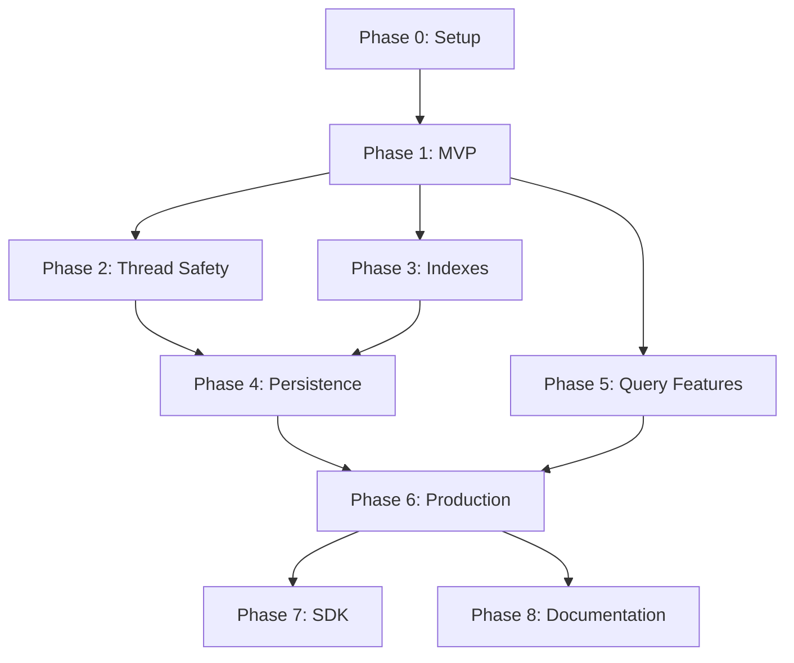

# Vector Database REST API - Revised Implementation Plan

## Critical Analysis of Original Plan

### Issues Identified:
1. **Tasks Too Large**: Many "tasks" are actually 5-10 subtasks bundled together
2. **Missing Dependencies**: Task order doesn't account for dependencies
3. **Over-Engineering Risk**: Starting with all features at once instead of MVP
4. **Unclear Acceptance Criteria**: No definition of "done" for each task
5. **No Time Estimates**: Hard to plan sprint/timeline
6. **Missing Practical Tasks**: Environment setup, config management, etc.

## Revised Approach: MVP-First with Incremental Enhancement

### Core Philosophy:
- **Start Simple**: Get basic CRUD + brute force search working first
- **Iterate**: Add complexity only after core is solid
- **Test Early**: Each task includes its own tests
- **Ship Often**: Deployable state after each phase

---

## Phase 0: Project Setup (Day 1)
**Goal**: Development environment ready

### Task 0.1: Initialize Repository (30 min)
- [ ] Create GitHub repository
- [ ] Add .gitignore for Python
- [ ] Create README with project description
- [ ] Set up branch protection for main
- **Done**: Repository accessible, README visible

### Task 0.2: Set Up Python Environment (45 min)
- [ ] Create virtual environment
- [ ] Create requirements.txt with initial dependencies
- [ ] Create requirements-dev.txt for testing tools
- [ ] Add Makefile with common commands
- **Done**: `make install` works, dependencies installed

### Task 0.3: Project Structure (30 min)
- [ ] Create directory structure (src/, tests/, docs/)
- [ ] Add __init__.py files
- [ ] Create empty main.py
- [ ] Add pytest.ini configuration
- **Done**: `pytest` runs (even if no tests)

### Task 0.4: Configure Linting & Formatting (45 min)
- [ ] Set up black configuration
- [ ] Set up mypy configuration
- [ ] Set up flake8 configuration
- [ ] Add pre-commit hooks
- **Done**: `make lint` runs all checks

### Task 0.5: Docker Skeleton (30 min)
- [ ] Create basic Dockerfile
- [ ] Add docker-compose.yml
- [ ] Test container builds
- **Done**: `docker-compose up` starts (even if app doesn't work yet)

---

## Phase 1: Minimal Viable Product (Days 2-4)
**Goal**: Working API with basic functionality

### Task 1.1: Define Chunk Model (1 hour)
```python
# Just the Chunk model with basic fields
class Chunk(BaseModel):
    id: str
    text: str
    embedding: List[float]
```
- [ ] Create models/chunk.py
- [ ] Add basic validation
- [ ] Write 3 unit tests
- **Done**: Can create/validate Chunk objects

### Task 1.2: Define Document Model (1 hour)
```python
class Document(BaseModel):
    id: str
    chunks: List[Chunk]
```
- [ ] Create models/document.py
- [ ] Add validation for non-empty chunks
- [ ] Write 3 unit tests
- **Done**: Can create/validate Document objects

### Task 1.3: Define Library Model (1 hour)
```python
class Library(BaseModel):
    id: str
    name: str
    documents: List[Document] = []
```
- [ ] Create models/library.py
- [ ] Add name validation
- [ ] Write 3 unit tests
- **Done**: Can create/validate Library objects

### Task 1.4: Create In-Memory Repository (2 hours)
```python
class InMemoryLibraryRepository:
    def save(self, library: Library) -> Library
    def find_by_id(self, id: str) -> Optional[Library]
    def delete(self, id: str) -> bool
```
- [ ] Create repositories/library_repository.py
- [ ] Implement with simple dict storage
- [ ] NO threading yet (keep it simple)
- [ ] Write 5 unit tests
- **Done**: Can store/retrieve libraries in memory

### Task 1.5: Create Brute Force Index (2 hours)
```python
class BruteForceIndex:
    def add_vector(self, id: str, vector: List[float])
    def search(self, query: List[float], k: int) -> List[Result]
```
- [ ] Create indexes/brute_force.py
- [ ] Use simple list storage
- [ ] Implement cosine similarity
- [ ] Write 5 unit tests
- **Done**: Can search vectors with brute force

### Task 1.6: Create Basic Library Service (2 hours)
```python
class LibraryService:
    def create_library(self, name: str) -> Library
    def get_library(self, id: str) -> Library
    def delete_library(self, id: str) -> None
```
- [ ] Create services/library_service.py
- [ ] Wire up repository
- [ ] Add basic error handling
- [ ] Write 5 unit tests
- **Done**: Service layer works for libraries

### Task 1.7: Create FastAPI App (1 hour)
```python
app = FastAPI()
@app.post("/libraries")
@app.get("/libraries/{id}")
@app.delete("/libraries/{id}")
```
- [ ] Create api/main.py
- [ ] Add 3 basic endpoints
- [ ] Use dependency injection for service
- [ ] Manual testing with curl
- **Done**: Can create/get/delete libraries via HTTP

### Task 1.8: Add Document Endpoints (2 hours)
```python
@app.post("/libraries/{id}/documents")
@app.get("/libraries/{id}/documents/{doc_id}")
```
- [ ] Add document service methods
- [ ] Add API endpoints
- [ ] Test with curl
- **Done**: Can add/get documents

### Task 1.9: Add Basic Query Endpoint (2 hours)
```python
@app.post("/libraries/{id}/query")
# Just accepts embedding vector, returns top-k
```
- [ ] Add query service
- [ ] Wire up brute force index
- [ ] Add query endpoint
- [ ] Test with curl
- **Done**: Can query with vector

### Task 1.10: Integration Tests (2 hours)
- [ ] Write 10 integration tests for full flow
- [ ] Test error cases
- [ ] Test with FastAPI TestClient
- **Done**: Integration tests pass

### Task 1.11: Docker Deployment (1 hour)
- [ ] Update Dockerfile with app
- [ ] Test container runs
- [ ] Add health check endpoint
- [ ] Document in README
- **Done**: `docker-compose up` runs the API

**MVP Complete! Ship It!** 🚀

---

## Phase 2: Add Thread Safety (Days 5-6)
**Goal**: Handle concurrent requests safely

### Task 2.1: Implement Simple Lock (1 hour)
```python
import threading
self._lock = threading.Lock()
```
- [ ] Add lock to repository
- [ ] Wrap all methods with lock
- [ ] Write concurrent test
- **Done**: No data corruption with 10 concurrent requests

### Task 2.2: Implement Read-Write Lock (2 hours)
```python
class ReadWriteLock:
    def read_lock(self): ...
    def write_lock(self): ...
```
- [ ] Create locks/rw_lock.py
- [ ] Implement with threading.Condition
- [ ] Write unit tests
- **Done**: Readers don't block each other

### Task 2.3: Apply RW Lock to Repository (1 hour)
- [ ] Replace simple lock with RW lock
- [ ] Use read_lock for gets
- [ ] Use write_lock for saves/deletes
- [ ] Run concurrent tests
- **Done**: Better concurrency performance

### Task 2.4: Thread-Safe Index Updates (1 hour)
- [ ] Add lock to index class
- [ ] Protect add/remove operations
- [ ] Test concurrent updates
- **Done**: Index updates are atomic

### Task 2.5: Stress Testing (2 hours)
- [ ] Create stress test script
- [ ] Test with 100 concurrent operations
- [ ] Fix any race conditions found
- [ ] Document results
- **Done**: Handles 100 concurrent requests

---

## Phase 3: Advanced Indexes (Days 7-10)
**Goal**: Implement additional index algorithms

### Task 3.1: Create Index Interface (1 hour)
```python
class VectorIndex(ABC):
    @abstractmethod
    def search(self, query: np.ndarray, k: int) -> List[Result]
```
- [ ] Create indexes/base.py
- [ ] Define abstract interface
- [ ] Refactor BruteForce to implement it
- **Done**: Common interface for all indexes

### Task 3.2: Implement K-D Tree Structure (3 hours)
```python
class KDNode:
    point: np.ndarray
    left: Optional[KDNode]
    right: Optional[KDNode]
```
- [ ] Create indexes/kdtree.py
- [ ] Implement tree building
- [ ] Implement search with backtracking
- [ ] Write 10 unit tests
- **Done**: K-D tree builds and searches correctly

### Task 3.3: Implement LSH Hash Functions (2 hours)
```python
def random_hyperplane_hash(vector: np.ndarray) -> str
```
- [ ] Create indexes/lsh.py
- [ ] Generate random hyperplanes
- [ ] Implement hash function
- [ ] Test hash distribution
- **Done**: Vectors hash to buckets

### Task 3.4: Implement LSH Index (3 hours)
```python
class LSHIndex(VectorIndex):
    def __init__(self, num_tables: int, hash_size: int)
```
- [ ] Build multiple hash tables
- [ ] Implement approximate search
- [ ] Tune parameters
- [ ] Write tests for recall
- **Done**: LSH returns approximate results

### Task 3.5: Create Index Factory (1 hour)
```python
class IndexFactory:
    def create_index(type: str, **kwargs) -> VectorIndex
```
- [ ] Create indexes/factory.py
- [ ] Support all three index types
- [ ] Add to library metadata
- [ ] Test factory creation
- **Done**: Can create any index type

### Task 3.6: Add Index Selection to API (2 hours)
- [ ] Add index_type to library creation
- [ ] Modify service to use factory
- [ ] Test each index type via API
- [ ] Document in README
- **Done**: Users can choose index type

### Task 3.7: Performance Benchmarks (2 hours)
- [ ] Create benchmark script
- [ ] Test with 1K, 10K, 100K vectors
- [ ] Measure build and query times
- [ ] Add results to documentation
- **Done**: Performance documented

---

## Phase 4: Persistence (Days 11-13)
**Goal**: Data survives restarts

### Task 4.1: Design Persistence Interface (1 hour)
```python
class PersistenceManager(ABC):
    def save(self, data: Dict) -> None
    def load(self) -> Optional[Dict]
```
- [ ] Create persistence/base.py
- [ ] Define interface
- [ ] Plan file format
- **Done**: Interface defined

### Task 4.2: Implement JSON Persistence (2 hours)
```python
class JSONPersistence(PersistenceManager):
    # Save libraries as JSON (without embeddings)
```
- [ ] Create persistence/json_persistence.py
- [ ] Save library metadata only
- [ ] Implement load
- [ ] Test save/load cycle
- **Done**: Metadata persists

### Task 4.3: Implement Vector Persistence (2 hours)
```python
def save_vectors(library_id: str, vectors: Dict[str, np.ndarray])
```
- [ ] Use numpy.savez_compressed
- [ ] Separate file per library
- [ ] Test with large vectors
- **Done**: Vectors persist efficiently

### Task 4.4: Add Startup Recovery (2 hours)
- [ ] Load data on app startup
- [ ] Rebuild indexes from vectors
- [ ] Handle missing/corrupt files
- [ ] Test restart scenarios
- **Done**: App recovers state on restart

### Task 4.5: Implement Write-Ahead Log (3 hours)
```python
class WriteAheadLog:
    def append(self, operation: Dict)
    def replay(self) -> List[Dict]
```
- [ ] Create persistence/wal.py
- [ ] Append operations to log
- [ ] Implement replay logic
- [ ] Test crash recovery
- **Done**: WAL ensures durability

### Task 4.6: Add Checkpoint/Snapshot (2 hours)
- [ ] Periodic full state save
- [ ] Truncate WAL after snapshot
- [ ] Configure snapshot interval
- [ ] Test snapshot recovery
- **Done**: Efficient recovery from snapshots

---

## Phase 5: Query Features (Days 14-15)
**Goal**: Enhanced query capabilities

### Task 5.1: Add Metadata to Models (1 hour)
```python
class ChunkMetadata(BaseModel):
    created_at: datetime
    custom: Dict[str, Any]
```
- [ ] Enhance all models with metadata
- [ ] Add validation
- [ ] Update tests
- **Done**: Models have metadata

### Task 5.2: Implement Filter Parser (2 hours)
```python
class MetadataFilter:
    field: str
    operator: str  # eq, gt, contains
    value: Any
```
- [ ] Create query/filters.py
- [ ] Parse filter expressions
- [ ] Validate filter syntax
- **Done**: Can parse filters

### Task 5.3: Add Pre-Filtering (2 hours)
```python
def filter_chunks(chunks: List[Chunk], filters: List[Filter]) -> List[Chunk]
```
- [ ] Implement filter matching
- [ ] Apply before search
- [ ] Test various filters
- **Done**: Pre-filtering works

### Task 5.4: Add Post-Filtering (1 hour)
- [ ] Filter after search results
- [ ] Maintain result order
- [ ] Test with complex filters
- **Done**: Post-filtering works

### Task 5.5: Integrate Filters in API (2 hours)
- [ ] Add filters to query endpoint
- [ ] Update service layer
- [ ] Test via API
- [ ] Document filter syntax
- **Done**: API supports filtering

### Task 5.6: Add Text Query Support (2 hours)
- [ ] Mock embedding service
- [ ] Accept text in query endpoint
- [ ] Convert text to embedding
- [ ] Test text queries
- **Done**: Can query with text

---

## Phase 6: Production Features (Days 16-18)
**Goal**: Production readiness

### Task 6.1: Add Structured Logging (2 hours)
```python
import structlog
logger = structlog.get_logger()
```
- [ ] Set up structlog
- [ ] Add request ID tracking
- [ ] Log all operations
- [ ] Configure log levels
- **Done**: Structured logs work

### Task 6.2: Add Health Checks (1 hour)
```python
@app.get("/health")
@app.get("/ready")
```
- [ ] Add health endpoint
- [ ] Add readiness endpoint
- [ ] Check dependencies
- **Done**: Health checks work

### Task 6.3: Add Metrics (2 hours)
```python
from prometheus_client import Counter, Histogram
```
- [ ] Add prometheus metrics
- [ ] Track request counts
- [ ] Track latencies
- [ ] Expose metrics endpoint
- **Done**: Metrics available

### Task 6.4: Add Request Validation (2 hours)
- [ ] Validate vector dimensions
- [ ] Validate library names
- [ ] Better error messages
- [ ] Test validation
- **Done**: Invalid requests rejected cleanly

### Task 6.5: Add Rate Limiting (2 hours)
```python
from slowapi import Limiter
```
- [ ] Add rate limiter
- [ ] Configure limits
- [ ] Test rate limiting
- [ ] Document limits
- **Done**: Rate limiting works

### Task 6.6: Configuration Management (2 hours)
```python
from pydantic import BaseSettings
class Settings(BaseSettings):
    index_type: str = "brute_force"
```
- [ ] Create config.py
- [ ] Use environment variables
- [ ] Validate configuration
- [ ] Document all settings
- **Done**: Configuration externalized

---

## Phase 7: SDK & Client (Days 19-20)
**Goal**: Easy-to-use Python client

### Task 7.1: Create SDK Package Structure (1 hour)
- [ ] Create sdk/ directory
- [ ] Add setup.py
- [ ] Create client module
- **Done**: Package structure ready

### Task 7.2: Implement Basic Client (2 hours)
```python
class VectorDBClient:
    def create_library(self, name: str)
    def query(self, library_id: str, vector: List[float])
```
- [ ] HTTP client with requests
- [ ] Basic methods
- [ ] Error handling
- **Done**: Basic client works

### Task 7.3: Add Advanced Features (2 hours)
- [ ] Batch operations
- [ ] Async support
- [ ] Retry logic
- [ ] Connection pooling
- **Done**: Advanced features work

### Task 7.4: SDK Documentation (2 hours)
- [ ] Write docstrings
- [ ] Create usage examples
- [ ] Add to README
- [ ] Create tutorial notebook
- **Done**: SDK documented

### Task 7.5: SDK Tests (2 hours)
- [ ] Unit tests with mocks
- [ ] Integration tests
- [ ] Example scripts
- **Done**: SDK tested

---

## Phase 8: Documentation & Demo (Days 21-22)
**Goal**: Impressive documentation

### Task 8.1: API Documentation (2 hours)
- [ ] OpenAPI descriptions
- [ ] Example requests/responses
- [ ] Error codes documentation
- [ ] Postman collection
- **Done**: API fully documented

### Task 8.2: Architecture Documentation (3 hours)
- [ ] Create ARCHITECTURE.md
- [ ] Draw diagrams
- [ ] Explain design decisions
- [ ] Document trade-offs
- **Done**: Architecture documented

### Task 8.3: README Enhancement (2 hours)
- [ ] Quick start guide
- [ ] Feature list
- [ ] Performance benchmarks
- [ ] Contributing guide
- **Done**: Professional README

### Task 8.4: Record Demo Video #1 (2 hours)
- [ ] Script the demo
- [ ] Show installation
- [ ] Demo all features
- [ ] Edit video
- **Done**: Usage demo complete

### Task 8.5: Record Demo Video #2 (2 hours)
- [ ] Explain architecture
- [ ] Walk through code
- [ ] Discuss trade-offs
- [ ] Edit video
- **Done**: Design video complete

---

## Phase 9: Advanced Features (Optional, Days 23-25)

### Task 9.1: Leader-Follower Setup (1 day)
- [ ] Add leader election
- [ ] Implement replication
- [ ] Test failover
- **Done**: HA works

### Task 9.2: Temporal Integration (1 day)
- [ ] Set up Temporal
- [ ] Create workflow
- [ ] Add activities
- **Done**: Temporal works

### Task 9.3: Cohere Integration (4 hours)
- [ ] Add Cohere client
- [ ] Generate real embeddings
- [ ] Test with real data
- **Done**: Real embeddings work

---

## Critical Path & Dependencies



## Success Metrics Per Phase

### Phase 1 (MVP)
- [ ] 3 endpoints work
- [ ] Can store and query 100 vectors
- [ ] 20+ tests pass

### Phase 2 (Thread Safety)
- [ ] No data corruption with 100 concurrent requests
- [ ] Read performance not degraded

### Phase 3 (Indexes)
- [ ] All 3 indexes work
- [ ] LSH 10x faster than brute force at 10K vectors
- [ ] K-D tree works for low dimensions

### Phase 4 (Persistence)
- [ ] Data survives restart
- [ ] Recovery < 10 seconds for 10K vectors

### Phase 5 (Query Features)
- [ ] Metadata filtering works
- [ ] Text queries work

### Phase 6 (Production)
- [ ] 99% uptime
- [ ] P95 latency < 100ms
- [ ] Handles 100 RPS

### Phase 7 (SDK)
- [ ] SDK installable via pip
- [ ] All examples work

### Phase 8 (Documentation)
- [ ] 100% API documented
- [ ] Videos uploaded

---

## Time Estimates

| Phase | Optimistic | Realistic | Pessimistic |
|-------|------------|-----------|-------------|
| 0: Setup | 3 hours | 4 hours | 6 hours |
| 1: MVP | 12 hours | 18 hours | 24 hours |
| 2: Thread Safety | 5 hours | 7 hours | 10 hours |
| 3: Indexes | 10 hours | 14 hours | 20 hours |
| 4: Persistence | 8 hours | 12 hours | 16 hours |
| 5: Query Features | 6 hours | 9 hours | 12 hours |
| 6: Production | 8 hours | 11 hours | 15 hours |
| 7: SDK | 6 hours | 9 hours | 12 hours |
| 8: Documentation | 6 hours | 9 hours | 12 hours |
| **TOTAL** | **64 hours** | **93 hours** | **127 hours** |

---

## Risk Mitigation

### Technical Risks
1. **K-D Tree Performance**: May degrade for high dimensions
   - *Mitigation*: Document limitations, recommend LSH for high-dim

2. **Thread Safety Bugs**: Hard to test all race conditions
   - *Mitigation*: Use proven patterns, extensive testing

3. **Memory Usage**: Indexes may use too much RAM
   - *Mitigation*: Add memory monitoring, document limits

### Schedule Risks
1. **Underestimated Complexity**: Tasks take longer
   - *Mitigation*: Time boxes, MVP first approach

2. **Debugging Time**: Not accounted for
   - *Mitigation*: Buffer time in estimates

---

## Definition of Done Checklist

For EVERY task:
- [ ] Code written and works
- [ ] Unit tests written and pass
- [ ] Type hints added
- [ ] Docstrings added
- [ ] No mypy errors
- [ ] No flake8 errors
- [ ] Code reviewed (self)
- [ ] Documentation updated if needed
- [ ] Commit message clear

---

## Key Improvements Over Original Plan

1. **Granular Tasks**: Each task is now 30min-3hours max
2. **Clear Dependencies**: Can see what must come before what
3. **MVP First**: Get something working quickly, then enhance
4. **Time Estimates**: Can actually plan and track progress
5. **Acceptance Criteria**: Clear "done" definition for each task
6. **Practical Focus**: Includes setup, config, logging, etc.
7. **Progressive Enhancement**: Each phase builds on previous
8. **Risk Mitigation**: Identified and planned for
9. **Success Metrics**: Measurable outcomes per phase
10. **Realistic Timeline**: ~93 hours of focused work

This revised plan is much more actionable and follows software engineering best practices for project execution.